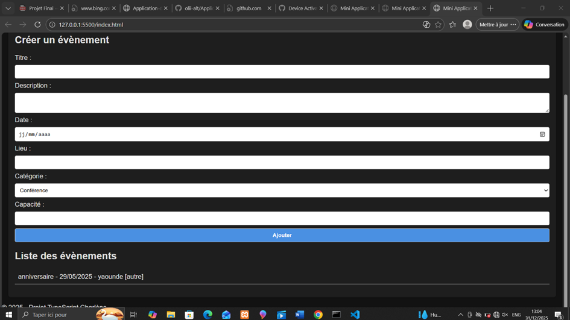
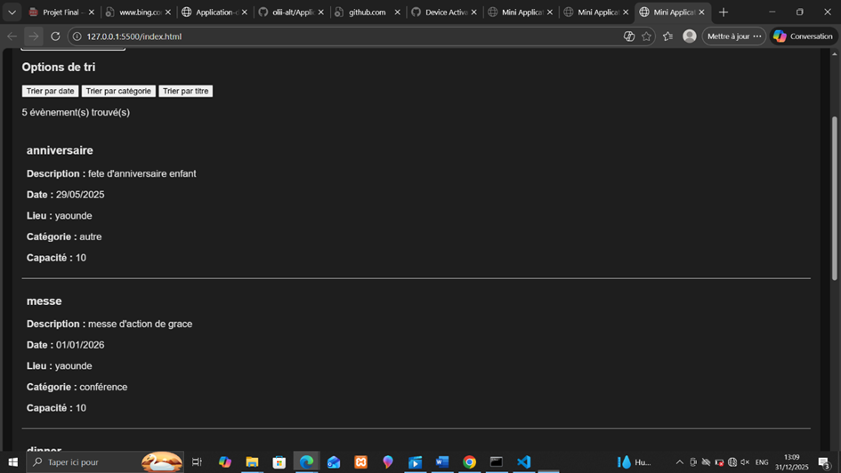
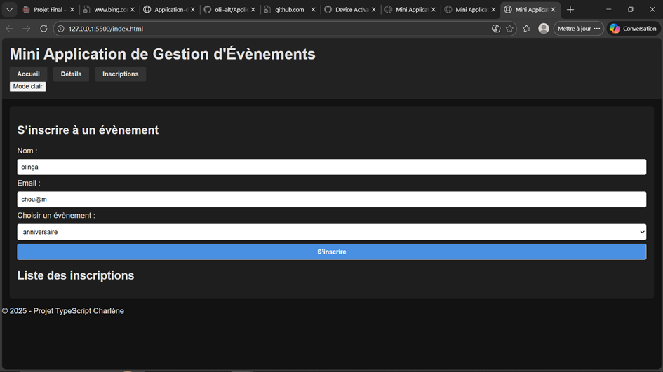
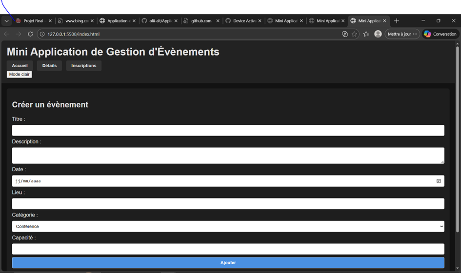

# Mini Application Web de Gestion d'Évènements

Ce projet est une application web développée en **TypeScript**, **HTML** et **CSS**.  
Il permet de créer, afficher et gérer des évènements, ainsi que les inscriptions des utilisateurs.  
Ce travail a été réalisé dans le cadre du projet final de Licence 2 (année académique 2025-2026).

---

##  Objectifs
- Mettre en pratique TypeScript dans un projet réel.
- Utiliser la programmation orientée objet (POO).
- Organiser le code en modules et fichiers séparés.
- Gérer des données via des tableaux en mémoire.
- Créer une interface simple et fonctionnelle sans framework.

---

##  Fonctionnalités
- Création d'évènements 
- Affichage de la liste complète 
- Filtre par catégorie / date 
- Page Détails affichant tous les évènements 
- Inscription d'un utilisateur 
- Vérification des doublons (éviter double inscription) 
- Gestion capacité & places restantes 
- Empêcher inscription si évènement complet ou déjà passé 
- (Bonus) Mode sombre / responsive 

---

##  Structure du projet


event-app/
├── index.html
├── styles/
│   └── main.css
├── src/
│   ├── models/
│   │   ├── Event.ts
│   │   ├── User.ts
│   │   └── Registration.ts
│   └── main.ts
├── dist/
│   └── fichiers compilés JS
├── tsconfig.json
├── package.json
├── .gitignore
└── README.md
## Installation & lancement

1. Installer les dépendances :
   ```bash
   npm install
npm run build
ancer l'application :

Ouvrir index.html dans un navigateur


---

### 5. **Mode d’utilisation**
Explique comment utiliser ton app :
- Comment créer un évènement.  
- Comment filtrer/rechercher.  
- Comment s’inscrire.  
- Que se passe si l’évènement est complet ou déjà passé.

---

### 6. **Captures d’écran**
Ajoute des images montrant :
- Page d’accueil avec liste d’évènements
---
!

- Page Détails.  

- Formulaire d’inscription. 
 
- (Bonus) Vue mobile / mode sombre.
[alt text](image.png)
-

